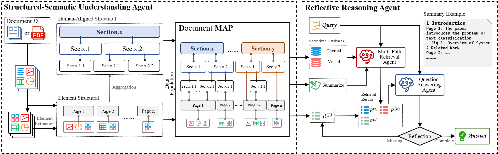

# DMAP

## Overview



We propose DMAP, a novel multi-modal framework for document question answering. We designed a Structured-Semantic Understanding Agent to construct DMAP by organizing textual content together with figures, tables, charts, etc into a human-aligned hierarchical schema that captures both semantic and layout dependencies. Building upon this representation, a Reflective Reasoning Agent performs structure-aware and evidence-driven reasoning, dynamically assessing the sufficiency of retrieved context and iteratively refining answers through targeted interactions with DMAP. Extensive experiments on MMDocQA benchmarks demonstrate that DMAP yields document-specific structural representations aligned with human interpretive patterns, substantially enhancing retrieval precision, reasoning consistency, and multimodal comprehension over conventional RAG-based approaches.

## Requirements

1. Clone this repository and navigate to DMAP folder

   ```bash
   git clone https://github.com/Forlorin/DMAP.git
   cd DMAP
   ```

2. Install package with conda.

   ```bash
   conda create -n dmap python=3.12
   conda activate dmap
   bash install.sh
   ```

3. Download the dataset and place it in the data directory. The Dataset we use is same to [MDocAgent](https://github.com/aiming-lab/MDocAgent).

4. Download & install [pdffigure2](https://github.com/allenai/pdffigures2), put it in `./mydatasets/pdffigure2/` and configure it well. Make sure that the `run_pdffigure2.sh` is in the same folder with the `src/` folder of pdffigure2.

## Configuration

System behavior is controlled by editing `config/config.toml`. The main settings are:

```toml
[run_args]
work_dir = "/path/to/your/file"  # main directory
cuda_visible_devices = "0,1"     # CUDA devices
sample_select_num = 1000         # number of samples, -1 = unlimited

[retrieval]
sample_select_num = -1
top_k = 10                       # number of retrieved items
```

## DMAP construction

To debug the whole pipeline you can first run the document-parser `extract.py`, then the DMAP-builder `summary.py`.
Once debugging is finished, simply uncomment the last part of `extract.py` to perform the full build in one shot.

```bash
python scripts/extract.py --config-name <dataset-name> --run-name <run-name> # # dataset-name is the folder name of one dataset, e.g. MMLongBench
python scripts/summary.py --config-name <dataset-name> --run-name <run-name>
```

## Dense retrieval

Run dense retrieval (text + image) with the command below.
If the index does not yet exist, it will be built automatically.
To debug the text or image module separately, comment out the corresponding part and run each on its own.

```bash
python scripts/retrieval.py --config-name <dataset-name> --run-name <run-name>
```

The retrieval results will be stored in:

```
data/<dataset>/<run-name>/<time>-results.json
```

## Predict & eval

Perform inference and evaluation with:

```bash
python scripts/predict.py --config-name <dataset-name> --run-name <run-name>
python scripts/eval.py --config-name <dataset-name> --run-name <run-name>
```
